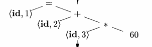

# [Compilers - Principles, Techniques and Tools , Aho ]()

- [1. Introduction](#introduction)
  - [1.1 Language Processors](#11-language-processors)
  - [1.2 Structure of a Compiler](#12-strucutre-of-a-compiler)

## 1. Introduction

This Chapter is a high level overview of the structure of a Compiler.

### 1.1 Language Processors

**Compiler:** A compiler is a program that can read a program in one language (the source language) and translate it into an equivalent program in another language a.k.a Target language.

**Interpreter:** An interpreter is a also a language processor that directly executes the operations in source program on inputs instead of producing a target program.

- An interpreter gives better **error diagnostics** than a compiler.

- But the machine-language produced by compiler is much **faster** than an interpreter.

**Hybrid Compilers:**
Java language processors combine both compilation and interpretation. In Java

- The source program is first compiled to an intermediate _byte code_
- Then the JVM interprets the byte code

> ##### JIT - Just In Time
> For faster processing some java compilers translate byte code immediately before they the intermediate program to process input

A source program maybe divided into modules stored in seperate files. A **Preprocessor** collects the source program and expands shorthands ( macros ) 

Assembly-language program is produced as output because its easier to produce and to debug, This is then process by an _assembler_ 

Assembler produces relocatable machine code, this code is linked together using a _Linker_. The a _Loader_ puts together all the executable objects into memory.

> Relocatable in the sense the code in one file refers to a location in another file

so the steps are as follows
- Preprocessor
- Compiler
- Assembler
- Linker/Loader

### 1.2 Strucutre of a Compiler
Compiler has 2 parts 
- Analysis
- Synthesis

Are often called the frontend and backend of a compiler

##### Analysis
This part breaks program into pieces and imposes grammatical structure. Then uses this to create intermediate source program. In the process provides messages about errors.

This parts collects and stores information about source program in _symbol table_ which is passed to the synthesis part

##### Synthesis
This part constructs the target program from the symbol table and intermediate program from analysis. 

##### **Phases of a compiler**
character stream is read by 
- Lexical Analyzer -> token stream
- Syntax Analyzer -> syntax tree
- Semantic Analyzer -> syntax tree
- Intermediate Code Generator - intermediate representaion
- Machine-Independent Code Optimizer - intermediate representation
- Code Generator -> target machine code
- Machine-Dependent Code Optimizer -> target machine code

Machine independent optimization is seen in few compilers. Both optmizations are optional.

#### **1.2.1 Lexical Analysis**
Lexical analysis or scanning reads the source program and groups characters into _lexemes_. For each lexeme the lexical analyser produces an output token that is passed to next phase.

${\langle token-name, attribute-name \rangle}$

the ${token-name}$ is an abstract symbol and ${attribute-value}$ points to a symbol table entry.

E.g.: position = initial + rate * 60

position -> ${\langle id, 1 \rangle}$

here 1 points to the sybmol table entry

= -> ${\langle = \rangle}$

initial -> ${\langle id, 2 \rangle}$

\+ -> ${\langle + \rangle}$ 

rate -> ${\langle id, 3 \rangle}$

\* -> ${\langle * \rangle}$

60 -> ${\langle 60 \rangle}$ 60 or number,4 where 4 points to symbol table entry

#### **1.2.2 Syntax Analysis**
Syntax analysis or parsing, a parser takes tokens and creates a tree that represents the grammatical structure of the token strean.

In this tree each node represent an operation and the children represent arguments

#### ****1.2.3 Semantic Analysis****
Semantic analyser uses syntax tree and symbol table to check if its consistent with the language's define grammar (defined by CFGs) and also saves type info in symbol table or tree

it also does type checking and reports errors. sometimes it converts or coerces types. _coersion_ (this is implicit type conversion - coersion)

#### ****1.2.4 Intermediate Code Generation****
Between source program and target code there can be multiple intermediate representations of the same code in lots of forms.

after syntax and semantic analysis the compiler generates low level or machine like code which is easy to produce and easy to translate to target code.

Three address code is used which is assembly-like instructions with only 3 operands per instruction. each operand in like a register 

this phase outputs the three address code sequence

some features of three address code instructions
- only one operator on right side
- only 3 operands
- there is a temporary name to hold the computed values.
- some have less than 3 operands, but maximum is 3

#### ****1.2.5 Code Optmization****
This phase improves the intermediate code for better result (faster/shorter/less power consuming)

#### **1.2.6 Code Generation**
This phase maps the intermediate form to the target language

Registers or memory locations are selected and assigned to hold variable in a judicious way

#### **1.2.7 Sybmol Table Management**
Symbol contains a record for each variable name with fields for attributes like storage, type, scope type returned etc.

Phases are grouped into _**passes**_

some compilers are created to fit well with intermediate representations so that we can produce many compilers by combining different front ends with the back end.

#### **1.2.9 Compiler Construction Tools**
Some Specialized tools
- Parser Generators
- Scanner Generators
- Syntax-directed translation engines
- Code-generator generators
- Data-flow analysis engines
- Compiler Construction toolkits